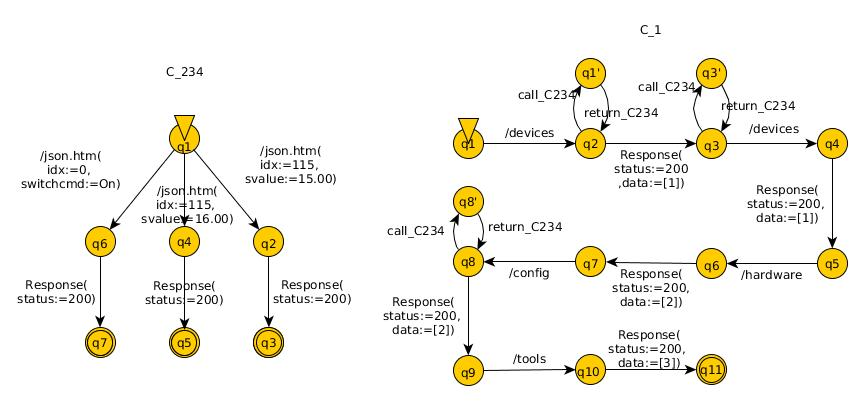
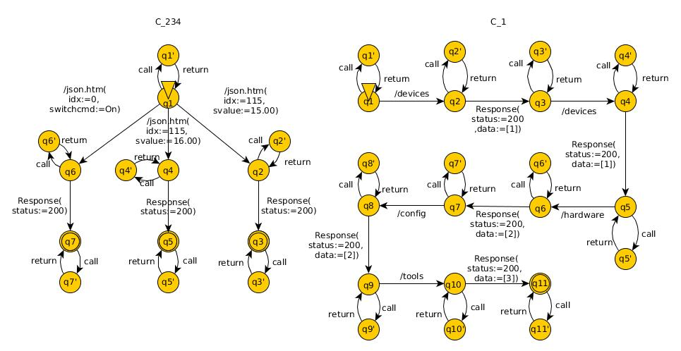

# COnfECt
This is the first implementation of the COnfECt method, used for preliminary tests.

## Method

COnfECt is a model inference method that infer LTSs (Labelled Transition Systems) for each component of the system from execution traces. 
It is based on KTails, a passive model learning method that work in two steps:

- First, it constructs a tree from the traces, with each branch of the tree corresponding to a trace, and each event to an edge.
- Then, it merges all states of this tree that have the same k-future, i.e. the states that have the same future of length k.

The method COnfECt add two steps to KTails: *Trace Analysis & Extraction*, and *LTS synchronisation*.

### Trace Analysis & Extraction

In this step, we try to separate events in a trace that are due to different components.

For that we calculate a *Correlation Coefficient* for each pair of events, and we define a treshold above which two components are due to the same component (we say that they have a strong correlation).
This *Correlation Coefficient* is used to separate each trace into many traces, containing events of only one component.

Example:
```
Trace		
/devices /json.htm(idx:=115,svalue:=15.00) Response(status:=200) Response(status:=200,data:=[1]) 
/json.htm(idx:=115,svalue:=16.00) Response(status:=200) /devices Response(status:=200,data:=[1]) 
/hardware Response(status:=200,data:=[2]) /config /json.htm(idx:=0,switchcmd:=On) Response(
status:=200) Response(status:=200,data:=[2]) /tools Response(status:=200,data:=[3])

STraces = {
T1 {/devices call_C2 return_C2 Response(status:=200,data:=[1]) call_C3 return_C3 /devices 
	Response(status:=200,data:=[1]) /hardware Response(status:=200,data:=[2]) /config call_C4 
	return_C4 Response(status:=200,data:=[2]) /tools Response(status:=200,data:=[3])}
T2 {call_C2 /json.htm(idx:=115,svalue:=15.00) Response(status:=200) return_C2}
T3 {call_C3 /json.htm(idx:=115,svalue:=16.00) Response(status:=200) return_C3}
T4 {call_C4 /json.htm(idx:=0,switchcmd:=On) Response(status:=200) return_C4} }
```


Each trace obtained with this step will produce a LTS with the first step of KTails.

### LTS Synchronisation

The goal of this step is to join LTSs that contain similar events, and model behaviours of the same component.

Three strategies are implemented:
- the **Strict** strategy, where we want limit the over-generalisation. we do not join LTSs, and we cannot repetitively call an other component.


- the **Weak** strategy, where we want to reduce the number of components. We join LTSs, and allow repetitive call of an other component.


- the **Strong** strategy, where we obtained a more general model. We join LTSs, and each LTS can call any other LTS anytime.


Then the models are generalised with the second step of KTails, to obtain the final LTSs.

## Contents
**traces/** contains the different test cases (*Exp1-Exp7*, and test cases for the time execution).

**results/** contains the results of the different experiments.

**COnfECt/** contains the implementation of the COnfECt method.

## Usage

Put all your traces in the folder **COnfECt/traces**. If the folder **COnfECt/COnfECt** does not exist, make it. It have to be empty.

Go into the **COnfECt/** folder and execute the script **exec.sh** with the synchronisation strategy as arguments (```strict```, ```weak```, or ```strong```):

```
cd COnfECt
./exec.sh strict
```

Results are generated in the **COnfECt/COnfECt** folder.

## TODO

- [ ] put the correlation coefficient and similarity coefficient as arguments
